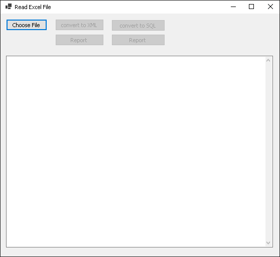

# Техническое задание
Необходимо сделать docx-отчет по данным из xlsx-файла.
xlsx-файл (test.xlsx) содержит первичные данные.
Их необходимо сконвертировать либо в базу данных SQL, либо в xml-файл с определенной структурой.
На основании данных SQL или xml-файла нужно сформировать docx-отчет.
docx-отчет должен предоставлять информацию, о том сколько в предоставленных данных:
1. мужчин и женщин.
2. мужчин в возрасте 30-40 лет.
3. стандартных и премиум-аккаунтов.
4. женщин с премиум-аккаунтом в возрасте до 30 лет.

При демонстрации решения на проверку данные в файле будут меняться. Отчет должен корректно формироваться на новых проверочных данных.

## Реализация

Есть 5 кнопок и поле для вывода технической информации

1. "Choose File" - выбираем наш файл "test.xlsx"
После этого у нас становятся доступны 4 другие кнопки
2. "convert to XML" - кнопка для преобразования файла xlsx в xml
3. "convert to SQL" - кнопка для преобразования файла xlsx в DBName.db
4. "report" под кнопкой "convert to XML" формирует отчет из xml, и записывает его в файл .docx в папке report
5. "report" под кнопкой "convert to SQL" формирует отчет из SQL, и записывает его в файл .docx в папке report

## Зависимости:
Пакеты:
* Aspose.Words - для формирования docx файлов
* IronXL.Excel - для чтения xlsx файлов и дальнейшего преобразования
* Microsoft.Data.Sqlite   - для работы с базой данных Sqlite
* System.Data.SqlClient   -/

# Стек
## С#, .NET 6.0, SQLite

